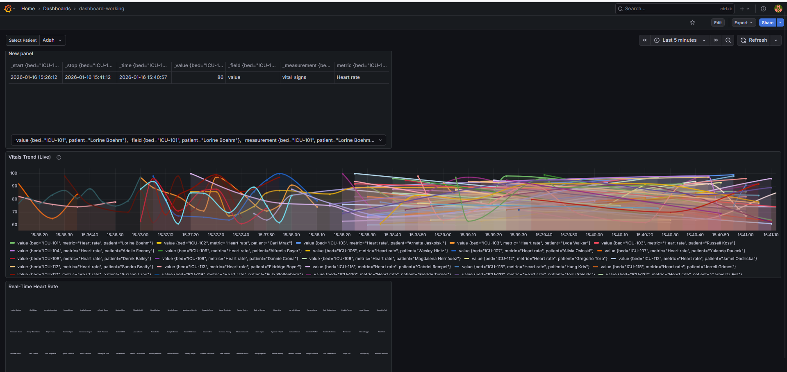

# Real-Time Healthcare Vitals Pipeline 🏥

An end-to-end streaming data pipeline that simulates, processes, and visualizes ICU patient vitals in real-time. Designed to detect critical health events (tachycardia, hypertension) with sub-second latency.

##  Architecture
* **Source:** Python Producer (Simulating Medical Data with Synthea)
* **Ingestion:** Apache Kafka (High-throughput buffering)
* **Storage:** InfluxDB (Time-Series Database)
* **Visualization:** Grafana (Real-time ICU Dashboard)
* **Infrastructure:** Docker & Docker Compose


## 🛠️ Setup & Run
1.  **Clone the repo:**
    ```bash
    git clone [https://github.com/theishachauhan/streaming-healthdata.git](https://github.com/theishachauhan/streaming-healthdata.git)
    cd streaming-healthdata
    ```
2.  **Start Infrastructure:**
    ```bash
    docker-compose up -d
    ```
3.  **Install Dependencies:**
    ```bash
    pip install -r requirements.txt
    ```
4.  **Run the Pipeline:**
    * Terminal 1: `python producer.py` (Generates Data)
    * Terminal 2: `python kafka_to_influx.py` (Bridges to Dashboard)

##  Dashboard
Access Grafana at `http://localhost:3000` (Default login: admin/password123).
